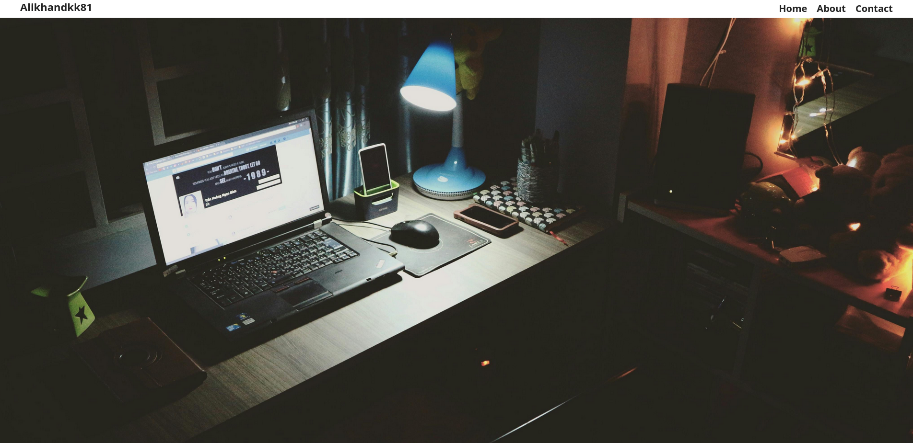
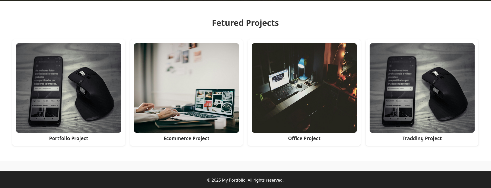

🌐 Django Portfolio Website

A simple and customizable portfolio website built with Django.
This project provides a clean structure for showcasing your personal information,projects, and contact details using Django’s powerful backend and templating system. you can customize.

📁 Project Structure

basic-portfolio/
    basic_portfolio/        # Django project settings & URLs
    portfolio/              # Main Django app (views, URLs, templates)
    static/                 # CSS, JS, images
    templates/              # HTML templates
    manage.py

✨ Features

    Django‑powered backend

    Clean and responsive UI/ can be customize fully responsive

    Organized template structure

    Static files for CSS, JS, and images

    Sections included:

        Home

        About

        Projects

        Contact

  🚀 Getting Started
1. Clone the repository
   
  git clone https://github.com/alikhandkk81/basic-portfolio.git
  cd basic-portfolio

3. Create and activate a virtual environment
   
   python -m venv venv
   source venv/bin/activate   # Linux/Mac
   venv\Scripts\activate      # Windows

3. Install dependencies

   pip install -r requirements.txt

4. Apply migrations

   python manage.py migrate

5. Run the development server

   python manage.py runserver

   Visit the site at:

   http://127.0.0.1:8000/

   
